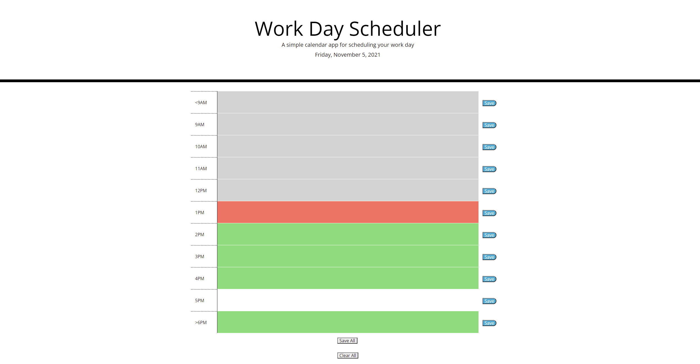

# Work Day Scheduler

## Description

This a scheduling application that allows the user to plan out their 9-5 work day by allowing them to:

- Input tasks in input fields separated by hour of the day.
- The ability to save tasks/remove tasks.
- Dynamically color codes depending on whether your task is in the future/past.

---

[Deployed Application](https://franskitzo.github.io/workday-planner/)

---

